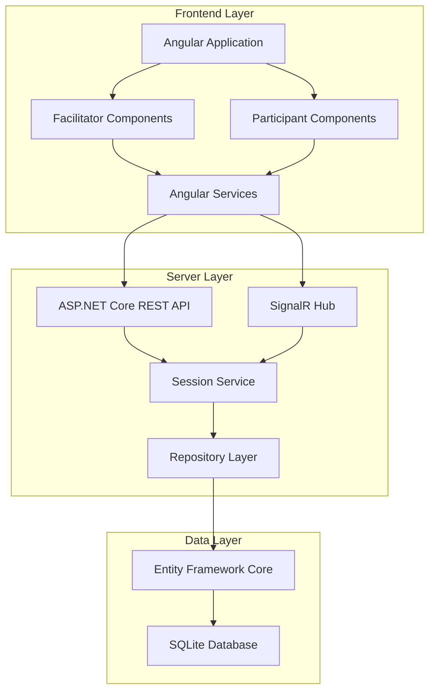

# Design Document - Agile Poker Planning App

## Overview

The Agile Poker Planning App is a lightweight web application that facilitates story point estimation sessions for development teams. The system consists of a C# REST API server with SQLite database for persistence, and an Angular frontend that provides an intuitive web interface for both facilitators and participants to interact with planning sessions.

The application follows a session-based model where facilitators create planning sessions through the web interface, participants join using session codes, and the system manages the estimation workflow through real-time updates using SignalR for live collaboration.

## Architecture

### High-Level Architecture



### Technology Stack

**Backend API:**
- ASP.NET Core 8.0 for REST API with minimal APIs
- SignalR for real-time communication
- Entity Framework Core for data access and migrations
- SQLite for lightweight, file-based database storage
- System.Text.Json for JSON serialization

**Frontend Application:**
- Angular 17+ with TypeScript
- Angular Material for UI components
- RxJS for reactive programming and state management
- SignalR client for real-time updates
- Angular HTTP client for REST API communication

**Deployment:**
- Angular SPA served as static files
- ASP.NET Core backend with integrated static file serving
- Portable SQLite database file
- Configuration via appsettings.json and environment files

## Components and Interfaces

### Core Components

#### 1. Session Service
**Responsibility:** Business logic layer for all session operations
- Manages session lifecycle (create, join, end)
- Handles participant management and vote processing
- Coordinates estimation rounds and consensus building
- Validates business rules and data integrity

**Key Methods:**
```csharp
public interface ISessionService
{
    Task<Session> CreateSessionAsync(string facilitatorName, string sessionName);
    Task<ParticipantInfo> JoinSessionAsync(string sessionCode, string participantName);
    Task AddStoryAsync(string sessionCode, string title); // Optional - simplified to title only
    Task SubmitVoteAsync(string sessionCode, string participantName, int estimate);
    Task<VoteResults> RevealVotesAsync(string sessionCode, int storyId);
    Task FinalizeEstimateAsync(string sessionCode, int storyId, int finalPoints);
    Task<SessionStatus> GetSessionStatusAsync(string sessionCode);
}
```

#### 2. SignalR Hub
**Responsibility:** Real-time communication between clients and server
- Manages connection groups by session code
- Broadcasts session updates to all participants
- Handles participant presence and voting status updates

**Hub Methods:**
```csharp
public class PlanningHub : Hub
{
    public async Task JoinSessionGroup(string sessionCode)
    public async Task LeaveSessionGroup(string sessionCode)
    public async Task NotifyVoteSubmitted(string sessionCode, string participantName)
    public async Task NotifyVotesRevealed(string sessionCode, VoteResults results)
    public async Task NotifySessionUpdated(string sessionCode, SessionState state)
}
```

#### 3. Repository Layer
**Responsibility:** Data access abstraction over Entity Framework Core
- Provides clean separation between business logic and data persistence
- Handles database operations with proper error handling
- Manages entity relationships and data consistency

**Key Repositories:**
```csharp
public interface ISessionRepository
{
    Task<Session> CreateAsync(Session session);
    Task<Session> GetByCodeAsync(string sessionCode);
    Task UpdateAsync(Session session);
    Task DeleteAsync(string sessionCode);
}

public interface IParticipantRepository
{
    Task<Participant> AddToSessionAsync(string sessionCode, Participant participant);
    Task<IEnumerable<Participant>> GetBySessionAsync(string sessionCode);
    Task UpdateVoteAsync(string sessionCode, string participantName, int estimate);
}
```

#### 4. Angular Frontend Components

**Core Components:**
- `SessionCreateComponent` - Form for creating new planning sessions
- `SessionJoinComponent` - Interface for joining existing sessions
- `FacilitatorDashboardComponent` - Session management for facilitators
- `ParticipantViewComponent` - Voting interface for participants
- `VotingCardsComponent` - Interactive Fibonacci sequence cards
- `ResultsDisplayComponent` - Vote reveal and consensus view

**Angular Services:**
```typescript
@Injectable()
export class SessionService {
  createSession(facilitatorName: string, sessionName: string): Observable<Session>
  joinSession(sessionCode: string, participantName: string): Observable<ParticipantInfo>
  addStory(sessionCode: string, title: string): Observable<void>
  submitVote(sessionCode: string, estimate: number): Observable<void>
  revealVotes(sessionCode: string, storyId: number): Observable<VoteResults>
  finalizeEstimate(sessionCode: string, storyId: number, points: number): Observable<void>
}

@Injectable()
export class SignalRService {
  startConnection(): Promise<void>
  joinSessionRoom(sessionCode: string): void
  onSessionUpdated(): Observable<SessionState>
  onVoteSubmitted(): Observable<string>
  onVotesRevealed(): Observable<VoteResults>
}
```

**Routing Structure:**
- `/` - Home page with create/join options
- `/create` - Session creation form
- `/join` - Session join form
- `/session/:code/facilitator` - Facilitator dashboard
- `/session/:code/participant` - Participant voting interface

## Data Models

### Entity Framework Core Models

```csharp
public class Session
{
    public int Id { get; set; }
    public string Code { get; set; } // 6-character unique identifier
    public string Name { get; set; }
    public string FacilitatorName { get; set; }
    public SessionStatus Status { get; set; }
    public DateTime CreatedAt { get; set; }
    public int? CurrentStoryId { get; set; }
    
    public virtual ICollection<Participant> Participants { get; set; }
    public virtual ICollection<UserStory> Stories { get; set; }
    public virtual UserStory CurrentStory { get; set; }
}

public class Participant
{
    public int Id { get; set; }
    public string Name { get; set; }
    public int SessionId { get; set; }
    public DateTime JoinedAt { get; set; }
    public DateTime? LastActivity { get; set; }
    
    public virtual Session Session { get; set; }
    public virtual ICollection<Vote> Votes { get; set; }
}

public class UserStory
{
    public int Id { get; set; }
    public string Title { get; set; }
    public int SessionId { get; set; }
    public int? FinalEstimate { get; set; }
    public StoryStatus Status { get; set; }
    public DateTime CreatedAt { get; set; }
    
    public virtual Session Session { get; set; }
    public virtual ICollection<Vote> Votes { get; set; }
}

public class Vote
{
    public int Id { get; set; }
    public int ParticipantId { get; set; }
    public int UserStoryId { get; set; }
    public int Estimate { get; set; }
    public DateTime SubmittedAt { get; set; }
    
    public virtual Participant Participant { get; set; }
    public virtual UserStory UserStory { get; set; }
}

public enum SessionStatus
{
    Active,
    Completed,
    Archived
}

public enum StoryStatus
{
    Pending,
    Voting,
    Estimated
}
```

### DTOs and Response Models

```csharp
public class SessionStatus
{
    public string Code { get; set; }
    public string Name { get; set; }
    public string FacilitatorName { get; set; }
    public int ParticipantCount { get; set; }
    public int StoriesCount { get; set; }
    public int EstimatedStoriesCount { get; set; }
    public UserStoryDto CurrentStory { get; set; }
    public List<ParticipantDto> Participants { get; set; }
}

public class VoteResults
{
    public int StoryId { get; set; }
    public string StoryTitle { get; set; }
    public List<VoteDto> Votes { get; set; }
    public bool HasConsensus { get; set; }
    public int? SuggestedEstimate { get; set; }
    public Dictionary<int, int> EstimateDistribution { get; set; }
}
```

### Database Configuration

**SQLite Database:**
- Single file database for portability
- Entity Framework Core migrations for schema management
- Connection string configuration via appsettings.json
- Automatic database creation on first run

## Error Handling

### API Error Responses
- Standardized error response format with HTTP status codes
- Detailed error messages for CLI user feedback
- Validation error aggregation for multiple field errors
- Proper exception handling with logging

### Command-Line Error Handling
- Input validation with clear error messages
- Network connectivity error handling
- Session not found or expired scenarios
- Duplicate participant name resolution

### Error Response Format
```csharp
public class ApiErrorResponse
{
    public string Message { get; set; }
    public string ErrorCode { get; set; }
    public Dictionary<string, string[]> ValidationErrors { get; set; }
    public DateTime Timestamp { get; set; }
}
```

### Common Error Scenarios
- Invalid session codes (404 Not Found)
- Duplicate participant names (409 Conflict)
- Session already completed (400 Bad Request)
- Invalid vote values (400 Bad Request)
- Database connection issues (500 Internal Server Error)

## Testing Strategy

### Unit Testing
- Session service business logic validation
- Vote calculation and consensus detection algorithms
- Repository layer data access operations
- Command-line argument parsing and validation

### Integration Testing
- End-to-end API workflow testing
- Database operations with Entity Framework Core
- CLI command execution and API communication
- Session lifecycle management across multiple participants

### Testing Tools
- xUnit for unit and integration testing
- Microsoft.AspNetCore.Mvc.Testing for API testing
- SQLite in-memory database for test isolation
- Moq for mocking dependencies in unit tests

## Security Considerations

### Session Security
- Session code generation using cryptographically secure random values (6-character alphanumeric)
- Session timeout and automatic cleanup after inactivity
- Input validation and sanitization for all user inputs

### Data Protection
- SQLite database with appropriate file permissions
- No storage of sensitive personal information
- Session data retention policy with automatic cleanup

### API Security
- Input validation on all endpoints
- Rate limiting for session creation
- HTTPS enforcement in production deployment

## Performance Considerations

### Database Optimization
- SQLite indexes on frequently queried columns (session codes, participant names)
- Efficient Entity Framework Core queries with proper includes
- Database connection pooling and proper disposal

### Frontend Performance
- Angular OnPush change detection strategy for optimal performance
- RxJS operators for efficient data streaming and caching
- Lazy loading of feature modules
- SignalR connection management with automatic reconnection

### Scalability
- Single-user deployment model (suitable for small to medium teams)
- Lightweight SQLite database for minimal resource usage
- Efficient polling mechanism for real-time-like updates

## Deployment Architecture

### Development Environment
- .NET 8.0 SDK for development and building
- SQLite database file in local development directory
- Hot reload support for API development
- Swagger/OpenAPI documentation for API testing

### Production Environment
- Self-contained executable deployment
- Portable SQLite database file
- Configuration via appsettings.json and environment variables
- Simple deployment model (single executable + database file)

### Frontend Distribution
- Angular build with production optimizations
- Static file serving from ASP.NET Core
- Environment-based configuration for API endpoints
- Responsive design for desktop and mobile devices